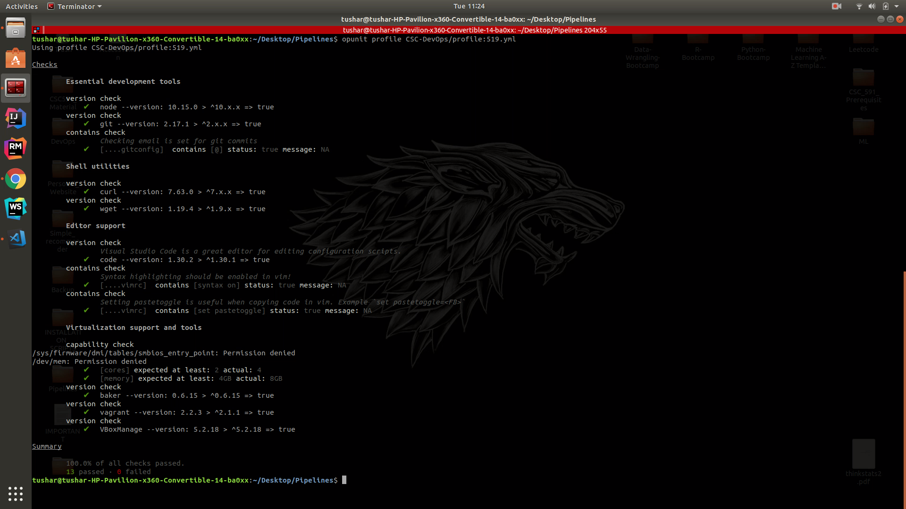
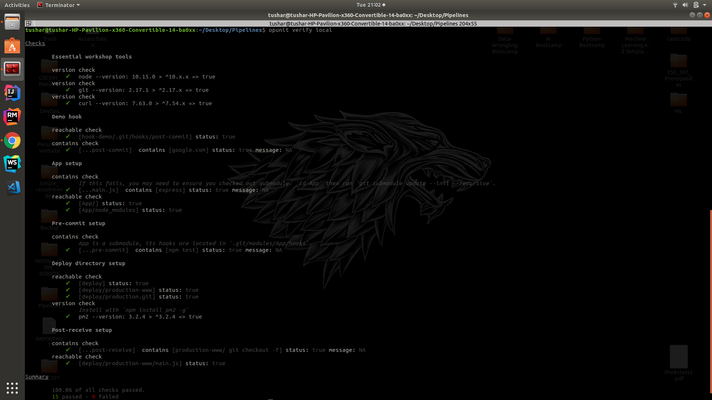

# CSC 519- DevOps Homework 0

This file will describe the deliverables for the Homework 0.


### Basic course setup (10)
* GitHub Profile : https://github.ncsu.edu/tdahibh

* Stack Overflow profile : https://stackoverflow.com/users/10903013/tushar-himmat-dahibhate


## GitHub

* HW0-DevOps Repository : https://github.ncsu.edu/tdahibh/HW0-DevOps

* HW0-App Repository : https://github.ncsu.edu/tdahibh/HW0-App

### Opunit checks

#### Opunit profile check

```bash
$ opunit profile CSC-DevOps/profile:519.yml

```
##### Screenshot: 



#### Opunit local verification

```bash
$ opunit verify local
```

##### Screenshot: 




## Screencast

https://www.youtube.com/watch?v=GjX5dX822ro&t=351s

